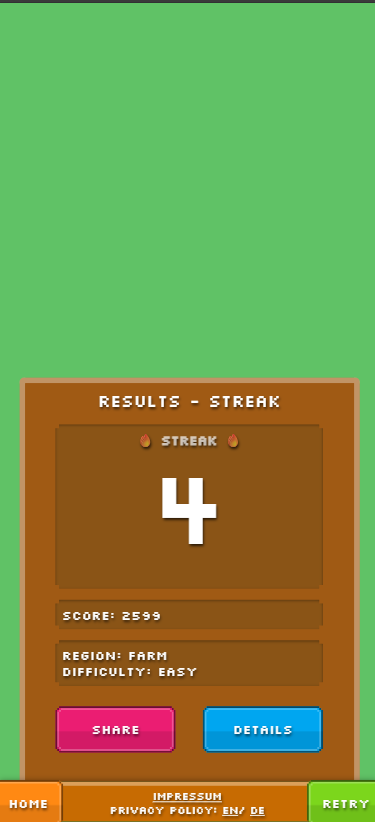

<h1> Disco Zoo Solver </h1>

A Heatmap Solver for the Game *Disco Zoo* by *Milkbag Games*.

<h2> Learn the best clicks for your animals </h2>

    
    

<h2> Put your knowledge to the t in the *Accuracy* modes! </h2>

    
    

## How it works
Sadly using just the highest overlapping tiles as the best play is not correct. In some instances this leads to solutions which in the worst case will take longer. For this reason i wrote an algorithm trying to find the solution with the highest probability while ensuring that the minimum number of moves are guaranteed.
The white bordered tiles are the best ones to pick.

## Setup
This is supposed to be a website that i host. But the algorithm is quite computation heavy, even with multiple optimizations. So currently if you want to use it, you need to install it yourself.

It's a Gradle Java+Vue project. So running `./gradlew bootRun` and `cd ./frontend/ && npm serve` should do the trick :).

